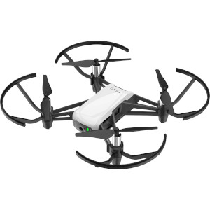

# DJI-Tello Java API

[](https://travis-ci.com/grofattila/dji-tello)
[](https://app.codacy.com/app/grofattila/dji-tello?utm_source=github.com&utm_medium=referral&utm_content=grofattila/dji-tello&utm_campaign=Badge_Grade_Dashboard)
[](https://www.codefactor.io/repository/github/grofattila/dji-tello)

This repository contains a pure Java implementation to communicate with DJI Tello Drone and sample 
client applications that can utilize the core tello library.

Feel free to contribute.


## Feature set

| Feature | status |
| ----------- | ----------- |
| Connect to Tello               | In progress |
| Read status values             | In Progress |
| Set command modes              | In progress |
| Send simple commands           | In progress |
| Send complex commands          | In progress |
| Receive video feed             | Not started |
| Command line Client            | In progress |
| JavaFx Client                  | In progress |
| Android client                 | Not started |
| Deep learning image analysis   | Not started |

## Tello Firmware

Supported firmwares currently: 1.3.0.0

## Module list

### Tello Core library

This module contains the actual implementation for connecting and sending commands to the drone.

### Tello Command line client
### Tello JavaFX GUI Client


License 
-------

```
MIT License

Copyright (c) 2020 Gróf Attila
```
